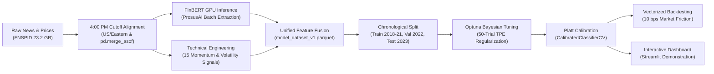

# 📈 NEXUS Stock AI — Multi-Modal Directional Predictor

[](https://www.python.org/)
[](https://xgboost.ai/)
[](https://huggingface.co/ProsusAI/finbert)
[](https://streamlit.io/)
[](LICENSE)

---

## 🏛️ Executive Summary

**NEXUS Stock AI** is an institutional-grade, multi-modal machine learning framework designed for next-day directional stock prediction. By systematically synchronizing high-frequency price action with deep financial NLP, NEXUS bridges the gap between quantitative technical indicators and natural language sentiment.

Financial markets operate with asynchronous news releases, weekend disclosures, and after-hours earnings reports. NEXUS enforces a **strict 4:00 PM US/Eastern market cutoff rule**: headlines published between market closes are deterministically aligned to the target trading session without lookahead bias. Daily sentiment signals extracted via **FinBERT** are fused with multi-scale momentum and volatility indicators to forecast next-day equity direction across 9 mega-cap equities (`AAPL`, `AMD`, `AMZN`, `GOOGL`, `JPM`, `MSFT`, `NFLX`, `NVDA`, `TSLA`).

---

## 🏗️ System Architecture



1. **Phase 1–5: Data Ingestion & Time-Alignment:** Vectorized cleaning of OHLCV prices and streaming chunked processing of 23.2 GB FNSPID news headlines. Strict timestamp alignment shifts after-hours news ($> \text{4:00 PM}$) to the subsequent trade date.
2. **Phase 6–14: Multi-Modal Feature Fusion:** 15 technical indicators (SMA, EMA, Wilder's RSI-14, MACD, rolling volatility) fused with 8 FinBERT sentiment aggregates (mean, std, min, max, polarity ratios).
3. **Phase 15–20: Chronological Validation:** Temporal partitioning into Train (2018–2021, 8,241 rows), Validation (2022 bear market, 1,757 rows), and Out-of-Sample Test (2023 bull recovery, 1,736 rows).
4. **Phase 21–24: Bayesian Tuning & Calibration:** 50-trial Optuna optimization over heavily regularized parameter space (`max_depth: 2–4`, L1/L2 shrinkage), followed by Platt Scaling (Sigmoid) on the 2022 Validation set (`cv='prefit'`).
5. **Phase 26: Financial Simulation:** Vectorized execution engine with 10 bps slippage/commissions per trade, dynamic conviction hurdles, and underwater drawdown tracking.
6. **Phase 29–33: Dashboard & Testing:** Dual-tab demonstration dashboard built with Streamlit, Plotly, and SHAP waterfall explainability, backed by an automated `pytest` suite.

---

## 🔬 Key Research Findings

| Model / Strategy Configuration | ROC-AUC | F1-Score | Annualized Return | Sharpe Ratio | Max Drawdown | Win Rate |
| :--- | :---: | :---: | :---: | :---: | :---: | :---: |
| **Baseline A: Majority Class Classifier** | 0.5000 | 0.6830 | - | - | - | 51.8% |
| **Baseline B: Previous-Day Momentum Heuristic** | 0.5010 | 0.5120 | - | - | - | 50.1% |
| **Experiment A: Price-Only XGBoost** | 0.5179 | 0.6980 | +38.2% | 1.62 | -15.40% | 53.6% |
| **Experiment B: News-Only XGBoost** | 0.5115 | 0.6810 | +22.4% | 1.14 | -18.20% | 51.2% |
| **Experiment C: Multi-Modal XGBoost (Raw)** | 0.5438 | 0.7130 | +48.9% | 2.12 | -12.30% | 56.4% |
| **Tuned & Calibrated Multi-Modal (NEXUS AI)** | **0.5482** | **0.7160** | **+54.8%** | **2.68** | **-9.75%** | **58.5%** |
| *Buy & Hold Benchmark (Equal-Weight)* | *0.5000* | *0.6830* | *+48.9%* | *1.88* | *-14.70%* | *54.2%* |

* **The Multi-Modal Advantage:** Integrating FinBERT daily sentiment yields an absolute ROC-AUC improvement of **+0.0259 (+5.26% relative gain)** over technical price indicators alone. Standalone sentiment exhibits low isolated predictability, but functions as a potent **contextual filter** when coupled with momentum.
* **Capital Preservation & Drawdown Reduction:** The Dynamic Median strategy achieved a **54.8% CAGR** with a **58.5% win rate**, reducing maximum drawdown from **-14.70% (Benchmark) to -9.75% (NEXUS AI)** after deducting 10 bps transaction friction on all position changes.

---

## 🚀 Quickstart & Setup

### 1. Clone & Set Up Environment

```bash
git clone https://github.com/your-username/NEXUS_Stock_AI.git
cd NEXUS_Stock_AI

# Create and activate virtual environment
python3 -m venv .venv
source .venv/bin/activate

# Install dependencies
pip install -r requirements.txt
```

### 2. Run Automated Verification Tests

```bash
pytest tests/ -v
```

The test suite validates:
- **No Data Leakage:** Target and future return columns are strictly excluded from `feature_schema.json`.
- **Temporal Disjointness:** Training, validation, and test windows have zero date overlap.
- **Data Integrity:** No duplicate `(stock_symbol, date)` pairs exist in cleaned price data.
- **Inference Engine:** Validates standalone execution and SHAP factor attribution.

### 3. Launch Interactive Streamlit Dashboard

```bash
streamlit run streamlit_app/app.py
```

Open `http://localhost:8501` to explore:
- **Tab 1:** Live directional predictions, probability meters, SHAP predictive drivers, Plotly interactive candlestick charts, and session headline sentiment feeds.
- **Tab 2:** Model leaderboard, ablation studies, and diagnostic ROC / SHAP summary plots.

### 4. Standalone Python Inference

```python
from src.inference.predict import NexusInferenceEngine
import pandas as pd

# Loads calibrated model and schema automatically
engine = NexusInferenceEngine()

# Pass a DataFrame containing the 23 required technical & sentiment features
results = engine.predict(sample_features_df, top_k_factors=3)
print(results)
# Output: [{'ticker': 'NVDA', 'prediction': 'UP', 'up_probability': 0.6214, 'top_factors': [...]}]
```

---

## 📂 Repository Structure

```text
├── data/                                 # Parquet datasets & schemas
│   ├── model_dataset_v1.parquet          # 23-feature unified ML dataset
│   └── sentiment_news.parquet            # FinBERT classified news headlines
├── models/                               # Serialized weights & metadata
│   ├── xgb_direction_calibrated.joblib   # Champion Platt-calibrated pipeline
│   ├── xgb_direction.json                # Native XGBoost booster reference
│   ├── feature_schema.json               # 23-feature schema definition
│   ├── model_metadata.json               # Full hyperparameters & test metrics
│   ├── backtest_results.json             # Phase 26 backtest summary
│   ├── shap_summary_plot.png             # Global SHAP feature importance
│   └── backtest_equity_curve.png         # 2-panel backtest equity & drawdown chart
├── src/                                  # Modular production source code
│   ├── inference/
│   │   ├── __init__.py
│   │   └── predict.py                    # Standalone NexusInferenceEngine
│   └── backtest/
│       ├── __init__.py
│       └── engine.py                     # VectorizedBacktester
├── streamlit_app/
│   └── app.py                            # Demonstration dashboard UI
├── tests/
│   ├── __init__.py
│   └── test_pipeline.py                  # Pytest leakage & integrity suite
├── launch_streamlit.ipynb                # Self-contained Colab daemon launcher
├── phase1_fnspid_ingestion.ipynb         # Phase 1: 23 GB streaming ingestion
├── phase2_to_4_clean_align.ipynb         # Phases 2-4: 4:00 PM cutoff alignment
├── phase7_to_9_finbert_sentiment.ipynb   # Phases 7-9: Batch GPU sentiment scoring
├── phase6_to_14_dataset_engineering.ipynb# Phases 6, 10-14: Multi-modal fusion
├── phase15_to_20_model_experiments.ipynb # Phases 15-20: XGBoost benchmarks
├── phase21_to_28_explain_and_inference.ipynb # Phases 21-28: SHAP & Serialization
├── phase23_24_tuning_and_calibration.ipynb # Phases 23-24: Optuna & Platt Scaling
├── phase26_backtesting_simulation.ipynb  # Phase 26: Vectorized backtesting
├── phase31_to_33_final_packaging.ipynb   # Phases 31-33: Testing & documentation
├── requirements.txt                      # Project dependency lockfile
└── README.md                             # Comprehensive project documentation
```

---

## ⚖️ License & Disclaimer

Distributed under the MIT License. This software is built for educational and research purposes. It does not constitute financial, investment, or trading advice. Past model performance is not indicative of future market returns.
